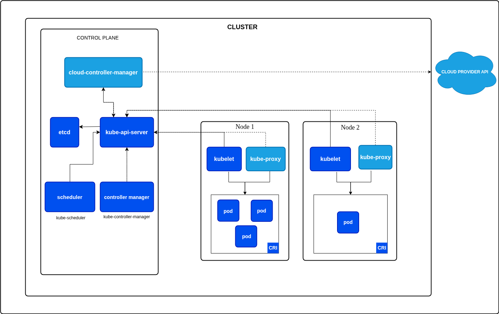

# Inception of Things

## Introduction

This project will consist of setting up several environments under specific rules.
It is divided into three parts you have to do in the following order:
• Part 1: K3s and Vagrant
• Part 2: K3s and three simple applications
• Part 3: K3d and Argo CD

## Some knowledge

### K3s

K3s is a Kubernetes distribution made by Rancher Labs. It is a lightweight Kubernetes distribution (compared to K8s) that is easy to install and use. Abscence of storage drivers and cloud. Docker needs to be installed if we want to use it.

### Vagrant

Vagrant is a tool used to automate the creation and deployment of virtual machines. Made by Hashicorp, which also made Terraform.

Define the configuration of a VM in a vagrantfile.
Can handle dependencies of a project, as libraries, DBs, etc.

	Vagrant.configure("2") do |	config|
		config.vm.box = "ubuntu/bionic64"
	end

Here, this simple vagrantfile only downloads an ubuntu box (like an image) and initializes it on a VM.

### Tips

	vboxmanage list runningvms #To show running vms
	vagrant ssh <VM_NAME> # To connect via ssh
	ip addr show # once connected in ssh, to show the private network ip (eth1)
   sudo kubectl get nodes -o wide # check nodes in a vm

   /etc/rancher/k3s/server/node-token # path to server/controller token

## Part 1: K3s and Vagrant

### Summary of Requirements

**Objective**: Set up 2 virtual machines using Vagrant and deploy K3s cluster

**Virtual Machine Specifications**:
- **Resources**: Minimal configuration (1 CPU, 512MB-1024MB RAM)
- **OS**: Latest stable distribution of your choice
- **Provider**: Vagrant

**Machine Configuration**:
1. **Server Machine**:
   - Name: `[team_login]S` (e.g., `wilS`)
   - Hostname: Same as name
   - IP: `192.168.56.110` on eth1 interface
   - Role: K3s controller/server mode

2. **Worker Machine**:
   - Name: `[team_login]SW` (e.g., `wilSW`)
   - Hostname: Same as name  
   - IP: `192.168.56.111` on eth1 interface
   - Role: K3s agent/worker mode

**Network & Access**:
- Dedicated IP addresses on eth1 interface
- SSH access without password on both machines
- Follow modern Vagrantfile practices

**Software Installation**:
- K3s on both machines (server mode on first, agent mode on second)
- kubectl for cluster management

**Key Implementation Points**:
- Use proper Vagrant configuration syntax
- Implement shell provisioning for K3s installation
- Ensure proper networking between machines
- Configure K3s cluster connectivity (server-agent communication)

### Testing

- `vagrant up` on the Vagrantfile location.
- `vagrant global-status` to see the VMs running and their id
- `vagrant destroy tgellonS -f` to destroy a VM
- `vagrant ssh tgellonS` to connect to a VM

- `sudo kubectl get nodes -o wide` to see the nodes in the cluster
- `sudo kubectl get pod -A` to see the pods
- `ip a show eth1` to see the configuration
-
- Si pbm de virtualisation sur le run *vagrant up* `kvm ` 

## Part 2 : K3s and 3 apps (+ Ingress)

### The 3 apps

There is one cluster containing 3 services, configured to be on the same ip address. The second app has 3 replicas (so 5 pods in total). Here we just need them to display a message saying hi from app x, depending on the host called with the ip. For that, we use Ingress.

### Ingress

Ingress is an API object that manages external access to the services in a cluster, typically HTTP. Ingress may provide load balancing, SSL termination and name-based virtual hosting.

Ingress exposes HTTP and HTTPS routes from outside the cluster to services within the cluster. Traffic routing is controlled by rules defined on the Ingress resource.

By default, Traefik is the ingress used on k3s, and it is enough for this part.

## Part 3 : K3D

K3d is a lighter version of kubernetes like k3s, but made to use docker containers.

## Ressources

Xavki - https://www.youtube.com/watch?v=KViZkMialxo&list=PLn6POgpklwWo6wiy2G3SjBubF6zXjksap

TechWhale - https://www.youtube.com/watch?v=aiquGLWWae4&list=PLCSOT8q0qCLy0p_mwjtAR8FNHcnAGw5mE

GOAT - https://blog.stephane-robert.info/docs/infra-as-code/provisionnement/vagrant/

Vagrant doc - https://developer.hashicorp.com/vagrant/docs

Kubernetes - https://kubernetes.io/docs/concepts/overview/

K3d and ArgoCD - https://www.sokube.io/en/blog/gitops-on-a-laptop-with-k3d-and-argocd-en

Install k3d - https://technonagib.fr/installer-k3d/